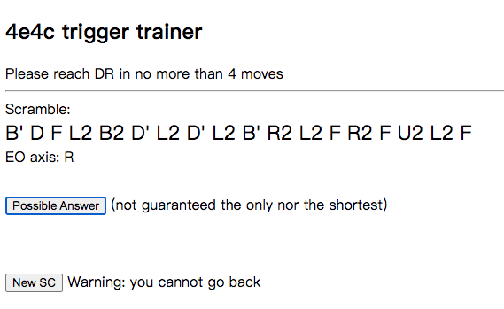

# dr-trainer

A very simple Domino Reduction trainer that gives a DR-4c4e scramble with a
solution no more 4 moves to DR.  The purpose was for me to practice DR triggers
for a comp, so it's very primitive and "just work".

This trainer is run as a website which can be run in local, or some remote
machine to serve public users



The scrambles are generated randomly, with a hint of EO axis but without
mentioning which DR axis it could be, so there are two possibilities (and by
chance usually only one of them is DR-4c4e with a short solution).  This is
to simulate how people do DR: solve one EO first, then inspect the other 2 axes.


## Install / Run

This is written in Python and takes advantage of Kociemba's [RubikTwoPhase](https://pypi.org/project/RubikTwoPhase/)
library.  You can run in local (especially during development) or in docker.


### Run in local

This command runs a web server in local http://localhost:3033/

```bash
$ make local
```

This will create ~100 MB table files in the same directory on the first run,
which can take minutes to an hour.


### Run in docker

You can build a docker image and then later run it on the same or another
machine (No this is not on the dockerhub lol)

The following commands build and run the website on port 80

This will create ~100 MB table files in the same directory on the first run,
which can take minutes to an hour.

```bash
# This builds the image, and outputs to dr-trainer.tgz
$ make docker-build

# Run the image
# (or make docker-run in the same machine)
$ docker load < dr-trainer.tgz
$ docker run -d -p 80:3033 --name dr_trainer dr-trainer
```


## How does this generate scrambles?
How I generate a scramble of DR-4c4e is dumb and naive:
1. I randomly pick a 4-move DR-4c4e case from what Jack has listed in
[this speedsolving forum thread](https://www.speedsolving.com/threads/the-fmc-thread.13599/page-261#post-1442832)
as the answer `S`
2. I create a cube in DR state by randomly applying G1 moves.  Then I simply
apply the inverse of `S` on it.  Therefore this is the cube of the quiz.
3. Generate a scramble of this cube by solving the cube using Kociemba's [RubikTwoPhase](https://pypi.org/project/RubikTwoPhase/)
library, and let the scramble be the inverse of the solution.  This step is just
how the normal scramblers work.

Currently I've observed some drawbacks:
* By the nature of Kociemba's algorithm, sometimes it's easy to generate an
"easy" scramble where the last few moves is the answer.  Usually it's not but it
happens
* There can be two DR axes; I apply the (inverse of) answer assuming one, but
that doesn't mean the other DR axis cannot have a shorter answer.  (Hence the
wording `not guaranteed the only nor the shortest`)
* This algorithm/strategy is based on a known set of answers.  In other words I
rely on Jack's knowledge here.  Therefore it's not an instant change to generate
say, a 5-move case or -4c2e, -3c2e without pre-defined answers.
